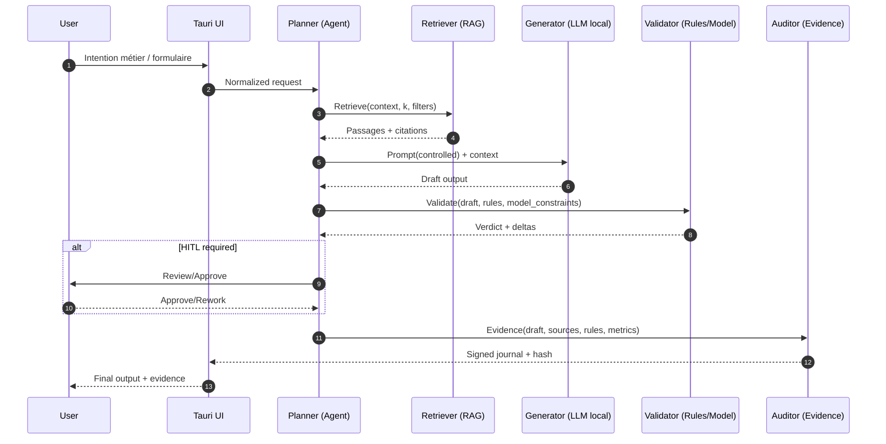
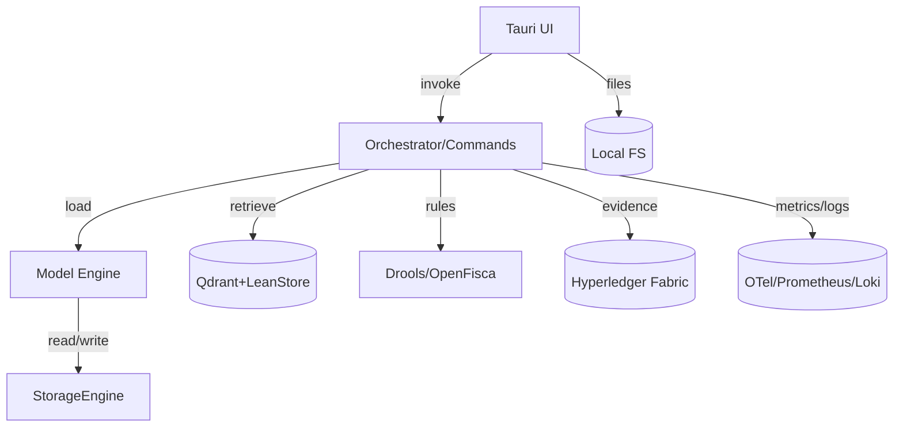
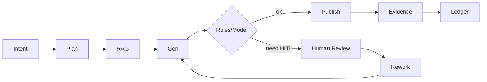

# GenAptitude — Functional Architecture

**Version :** 1.1 · **Date :** 2025-11-29 · **Auteur :** GenAptitude  
**Slogan :** _From Business Needs to Running Code_

> Document fonctionnel structurant la **vision**, le **périmètre**, les **acteurs**, les **capacités**, les **flux** et les **contrats** du MVP GenAptitude. Style : _Contexte → Décision → Étapes → Livrables_ (référentiel Arcadia/Capella OA/SA/LA/PA, MBAIE — Model‑based AI neuro‑symbolic Engineering).

---

## 0. TL;DR

- **Workstation‑first & souverain** : exécution locale (Rust/Tauri/WASM), RAG + règles, preuves on‑chain.
- **MBAIE** : modèles métiers explicites (JSON/JSON‑LD **avec validation sémantique forte**), LLM local (llama.cpp), règles (Drools/OpenFisca), **explicabilité by‑design**.
- **Packs Service** : cas d’usage prêts à l’emploi (KYC, Maintenance, PM/Support, MBSE) orchestrés par des **agents**.
- **Observabilité** : métriques/logs/traces (Prometheus/Loki/OpenTelemetry).

---

## 1. Contexte → Décision → Étapes → Livrables

### Contexte

- Besoin d’un **assistant métier local** et traçable pour accélérer les tâches répétitives (banques, industrie, PMO, dev).
- Contraintes : **souveraineté**, **frugalité énergétique**, **confidentialité**, capacité **offline**.
- Référentiel méthodo : **Arcadia/Capella** (OA/SA/LA/PA) + ontologies **JSON/JSON‑LD**.

### Décisions

1. **UI IA‑Native** : Tauri v2 + Vite/React (TS), orchestration locale, UX _planner + agents_.
2. **LLM local** : llama.cpp (GGUF), embeddings locaux; **RAG** via Qdrant + LeanStore.
3. **MBAIE** : pile **neuro‑symbolique** (LLM + Règles + Modèles Sémantiques).
4. **Traçabilité** : preuves hashées (Hyperledger Fabric) — _no source, no claim_.
5. **Observabilité** : Prometheus/Loki/OTel; budgets (latence, RAM, kWh/exécution).

### Étapes (MVP)

1. **Ingest & Index** (docs, schémas, référentiels) → pipelines d’extraction, normalisation et **typology sémantique**.
2. **RAG + Rules** (retrieval → plan → génération → validation par règles).
3. **HITL** (Human‑In‑The‑Loop) : confirmations, validations, signatures.
4. **Packaging** (bundle Tauri), **CI GitLab** (build web/wasm, bundle Linux).

### Livrables

- App desktop **GenAptitude** ; **dist/** web ; **bundle** AppImage/.deb/.rpm.
- **Catalogue** de schémas (JSON/JSON‑LD), **règles** déclaratives, **journaux d’évidence**.
- Tableaux de bord (observabilité, qualité, ROI).

---

## 2. Périmètre fonctionnel (OA)

- **Capture d’intention** (prompt/formulaires) & **Planner** (décomposition).
- **Ingestion** & **Nettoyage** (parsers, OCR optionnel).
- **Indexation** (vectorielle + symbolique).
- **RAG** (retrieval → contexte) + **Génération** (LLM local).
- **Validation** (règles / score / garde‑fous) + **HITL**.
- **Explication & Evidencing** (citations, règles, métriques, hash).
- **Publication** (fichiers, snippets, tickets, rapports).

---

## 3. Acteurs & Rôles (OA)

| Acteur/Rôle            | Attentes                                | Exemples d’actions                   |
| ---------------------- | --------------------------------------- | ------------------------------------ |
| **Utilisateur Métier** | Réduction temps, fiabilité, traçabilité | Soumet un besoin, valide un livrable |
| **Planner** (agent)    | Décomposer, ordonnancer                 | Génère un plan d’actions             |
| **Retriever** (agent)  | Chercher & coter                        | Récupère passages + sources          |
| **Generator** (agent)  | Rédiger, structurer                     | Génère sections, code, fiches        |
| **Validator** (agent)  | Contrôler                               | Règles, seuils, conformité           |
| **Auditor** (agent)    | Expliquer & prouver                     | Journal, citations, hash on‑chain    |
| **Ops**                | Run/observabilité                       | Observe, ajuste les budgets          |

---

## 4. Capabilities (SA)

- **C1 Ingest** : connecteurs, parsers, dédupliqueur.
- **C2 Normalize** : cleaners, typage JSON/JSON‑LD, **résolution sémantique**.
- **C3 Index** : Qdrant (vecteurs), index symbolique (ontologies).
- **C4 Plan** : analyse d’intention, plan heuristique.
- **C5 Retrieve** : top‑k, reranking local, citations.
- **C6 Generate** : LLM local (prompting contrôlé), gabarits.
- **C7 Validate** : règles (Drools/OpenFisca), seuils, garde‑fous, **conformité schéma**.
- **C8 Explain** : rationales, provenance, règles déclenchées.
- **C9 Evidence** : hash artefacts + ancrage Hyperledger Fabric (Atomicité garantie par WAL).
- **C10 Publish** : export (md/pdf/docx/json), intégrations (GitLab).
- **C11 Observe** : métriques/logs/traces (OTel → Prometheus/Loki).

---

## 5. Flux end‑to‑end (LA)



````

---

## 6\. Données & Schémas (SA/LA)

### Principes

- **JSON/JSON‑LD** : schémas versionnés (`$schema`, `@context`, `@type`). Le chargement repose sur une **expansion sémantique** pour garantir l'interopérabilité.
- **Modèle en Mémoire** : Les données sont projetées dans une structure **ProjectModel** fortement typée respectant les couches Arcadia (OA, SA, LA, PA, EPBS).
- **Répertoires dev** : `schemas/core/` (base), `schemas/domain/` (pack service).
- **Conventions** : kebab‑case pour fichiers ; `$id` stable ; `oneOf`/`anyOf` documentés.

### Exemple minimal (JSON Schema)

```json
{
  "$id": "urn:ga:schema:document:v1",
  "$schema": "[https://json-schema.org/draft/2020-12/schema](https://json-schema.org/draft/2020-12/schema)",
  "title": "GA Document",
  "type": "object",
  "properties": {
    "title": { "type": "string" },
    "sections": {
      "type": "array",
      "items": { "type": "string" }
    },
    "sources": {
      "type": "array",
      "items": { "type": "string", "format": "uri" }
    }
  },
  "required": ["title"]
}
```

### Ontologie (JSON‑LD ‑ extrait)

```json
{
  "@context": {
    "ga": "[https://genaptitude.example/vocab#](https://genaptitude.example/vocab#)",
    "title": "ga:title",
    "source": "ga:source"
  },
  "@type": "ga:Document"
}
```

---

## 7\. MBAIE : règles & explicabilité (SA/LA)

- **Règles** : Drools (priorités, faits), OpenFisca (calculs sociaux/éco), contraintes explicites.
- **Chaînage** : _RAG → Génération → Validation par règles_ ; si **non‑conforme**, rebouclage guidé.
- **Sémantique** : Utilisation du **Model Engine** pour garantir que les artefacts générés respectent la méta-modélisation Arcadia (ex: une Fonction doit être allouée à un Composant).
- **Explicabilité** : trace des règles déclenchées (+ inputs), seuils, score confiance; **journal signé**.
- **Tests** : suites d’exemples (golden), **assertions** de règles (Given/When/Then), **budget** ressources.

---

## 8\. UI IA‑Native (SA)

- **Panneau Intention/Planner**, **Contexte (RAG)**, **Résultats** avec **citations**.
- **Inspecteur** (règles déclenchées, seuils, graphe sémantique), **Journal d’évidence**.
- **Registry** de schémas, **Editeur** de prompts/règles (sandboxées en WASM).

---

## 9\. Non‑fonctionnels (PA)

- **Souveraineté & confidentialité** : local‑first, chiffrement repos/disque.
- **Frugalité (Green IT)** : _retrieval‑first_, **CPU‑first** si possible, limites kWh/exécution.
- **Perf** : p95 latence \< 2s (génération brève), cold‑start \< 5s, chargement modèle optimisé (threading).
- **Sécurité** : ZTA local, signature journaux, contrôle d’accès (roles).
- **Offline‑first** ; **reproductibilité** (versions binaires & modèles).

---

## 10\. Interfaces & Contrats (LA)

- **Local API (Tauri invoke)** : `jsondb_*` (CRUD), `load_project_model` (Semantic Loader), `run_plan`, `get_evidence`.
- **RAG** : Qdrant (HTTP/gRPC), embeddings locaux; schéma _chunk_ standardisé.
- **Ledger** : Hyperledger Fabric (chaîne “evidence”), API `submitEvidence(hash, meta)`.
- **CI** : GitLab (builds, releases), webhook _artifact published_.

---

## 11\. Observabilité & KPI

- **OTel** → Prometheus (métriques), Loki (logs), Tempo/Jaeger (traces).
- **KPI** : temps cycle, taux HITL, % conformités, coût/exec, énergie/exec, couverture sources, _hallucination‑rate_.
- **SLO** : disponibilité UI, délai preuve ≤ 2s, backlog HITL \< 24h.

---

## 12\. Roadmap (extraits)

- v1.2 : Editeur de règles guidé + tests automatiques.
- v1.3 : Pack “Maintenance industrielle” (RCA), “KYC avancé”.
- v1.4 : Génération _schema‑driven_ multi‑format (md/docx/pdf) + e‑signature.

---

## 13\. Annexes

### 13.1 Vue composants (haut‑niveau)



### 13.2 Parcours HITL (simplifié)



### 13.3 Structure de repo (rappel)

```
src/ | public/ | src-tauri/ | src-wasm/ | schemas/ | rules/ | dist/
```

---

## 14\. Critères d’acceptation (MVP)

- [ ] RAG local avec citations **obligatoires**.
- [ ] Validation par règles **activée** (KO → rebouclage).
- [ ] Chargement sémantique du modèle (JSON-LD $\rightarrow$ Arcadia Rust).
- [ ] Journal d’évidence avec **hash** publié.
- [ ] Tableau de bord **métriques** (latence, % HITL, conformance).
- [ ] Packaging Tauri et artifacts CI publiés.

<!-- end list -->

```

```
````
