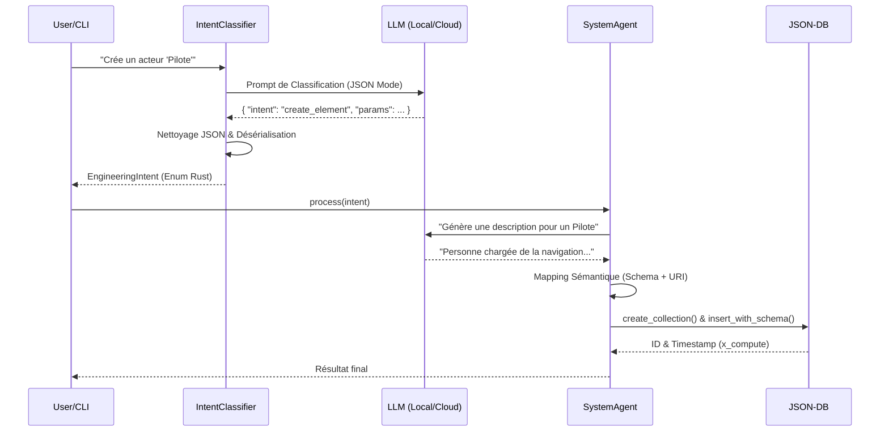

# Module `ai/agents` — Système Multi-Agents Neuro-Symbolique

Ce module implémente la logique **exécutive** de l'IA de GenAptitude. Il est responsable de transformer des requêtes en langage naturel (floues) en actions d'ingénierie formelles (strictes, validées et persistées).

## 🧠 Architecture et Flux de Données

Le système repose sur un pipeline en trois étapes : **Comprendre → Décider → Agir**.



---

## 📂 Structure du Module

### 1\. Le Contrat (`mod.rs`)

Définit le trait `Agent` que tous les agents spécialisés (Système, Logiciel, Matériel) doivent implémenter.

```rust
#[async_trait]
pub trait Agent {
    /// Traite une intention d'ingénierie.
    /// Retourne Ok(Some(message)) si l'action a été réalisée.
    async fn process(&self, intent: &EngineeringIntent) -> Result<Option<String>>;
}
```

### 2\. Le Cerveau Sémantique (`intent_classifier.rs`)

Ce composant utilise le LLM (en mode température basse) pour catégoriser la demande utilisateur en une structure de données Rust stricte.

- **Rôle** : Router / Parser.
- **Type de retour** : `EngineeringIntent` (Enum).
- **Fonctionnalités clés** :
  - Support du **Dual Mode** (Local Mistral / Cloud Gemini).
  - **Nettoyage robuste** des réponses JSON (suppression des échappements Markdown parasites comme `\_`).
  - Déduction automatique des couches (ex: "Acteur" → "OA").

### 3\. L'Agent Système (`system_agent.rs`)

L'ouvrier spécialisé dans les couches hautes de la méthode Arcadia (OA & SA).

- **Périmètre** :
  - **OA (Operational Analysis)** : Acteurs, Activités.
  - **SA (System Analysis)** : Fonctions, Composants Système.
- **Capacités** :
  - **Enrichissement** : Utilise le LLM pour générer des descriptions techniques en français si l'utilisateur ne les fournit pas.
  - **Mapping Schéma** : Associe automatiquement le bon schéma JSON (`.schema.json`) et le bon Type JSON-LD (`@type`) selon l'élément créé.
  - **Persistance** : Utilise `CollectionsManager` pour garantir l'intégrité référentielle (mise à jour de `_system.json` et `_meta.json`).

---

## 🛠️ Détails d'Implémentation

### Mapping Sémantique (Arcadia)

Le `SystemAgent` maintient la correspondance entre le vocabulaire naturel et l'ontologie technique :

| Langage Naturel | Couche | Collection   | Type JSON-LD (@type)     | Schéma JSON                               |
| :-------------- | :----- | :----------- | :----------------------- | :---------------------------------------- |
| **Acteur**      | OA     | `actors`     | `oa:OperationalActor`    | `arcadia/oa/actor.schema.json`            |
| **Activité**    | OA     | `activities` | `oa:OperationalActivity` | `arcadia/oa/activity.schema.json`         |
| **Fonction**    | SA     | `functions`  | `sa:SystemFunction`      | `arcadia/sa/system-function.schema.json`  |
| **Composant**   | SA     | `components` | `sa:SystemComponent`     | `arcadia/sa/system-component.schema.json` |

### Sécurité et Robustesse

1.  **Injection de Schéma** : Chaque document inséré reçoit une propriété `$schema` calculée relative, garantissant que l'objet reste valide même si on déplace les fichiers.
2.  **Auto-Repair** : Si la collection cible n'existe pas, l'agent la crée et l'enregistre dans l'index global avant l'insertion.

---

## 🚀 Utilisation

### Via le code (Rust)

```rust
// 1. Classifier
let classifier = IntentClassifier::new(client.clone());
let intent = classifier.classify("Crée une fonction 'Décoller'").await;

// 2. Exécuter
let agent = SystemAgent::new(client, storage);
agent.process(&intent).await?;
```

### Via le CLI (Terminal)

```bash
# Mode Simulation (Dry Run)
cargo run -p ai_cli -- classify "Crée un acteur Pilote"

# Mode Exécution (Écriture en base)
cargo run -p ai_cli -- classify "Crée un acteur Pilote" -x
```

---

## 🔮 Évolutions Futures

- [ ] **SoftwareAgent** : Pour la génération de code et les couches LA/PA.
- [ ] **Relations** : Capacité de lier deux éléments (ex: "L'acteur X réalise l'activité Y").
- [ ] **Validation** : Vérifier si un nom existe déjà avant création (unicité).
