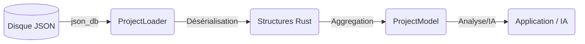

# Model Engine

Le **Model Engine** est la couche d'abstraction qui transforme les données brutes stockées dans la base de données (`json_db`) en structures Rust fortement typées et interconnectées.

Il agit comme un **ORM (Object-Relational Mapping)** spécialisé pour la méthode **Arcadia** et l'architecture **GenAptitude**.

---

## 🏗️ Architecture Globale

Le flux de données suit ce chemin :



---

## 📦 Rôles des Modules

| Module      | Description                                                                                                    |
| ----------- | -------------------------------------------------------------------------------------------------------------- |
| `model.rs`  | Définit la structure racine `ProjectModel` qui contient toutes les couches (OA, SA, LA, PA, EPBS) en mémoire.  |
| `loader.rs` | Contient la logique d'extraction (`ProjectLoader`). Il scanne les collections, valide et instancie les objets. |
| `common.rs` | Types primitifs partagés : `Uuid`, `I18nString` (multilingue), `BaseEntity` (ID, dates).                       |
| `arcadia/`  | Implémentation des concepts métier Arcadia (Acteurs, Fonctions, Composants) via des macros.                    |

---

## 🧠 Le Modèle en Mémoire (`ProjectModel`)

L'objet `ProjectModel` est le **jumeau numérique** du projet stocké sur le disque.  
Il est organisé par couches d'ingénierie :

```rust
pub struct ProjectModel {
    pub oa: OperationalAnalysisLayer,   // Besoins & Métier
    pub sa: SystemAnalysisLayer,        // Ce que fait le système
    pub la: LogicalArchitectureLayer,   // Comment (Logique)
    pub pa: PhysicalArchitectureLayer,  // Comment (Physique/Logiciel)
    pub epbs: EPBSLayer,                // Configuration Produits
    pub meta: ProjectMeta,              // Métadonnées globales
}
```

Chaque couche encapsule ses propres entités (acteurs, fonctions, composants, échanges, exigences, etc.) dans une vue cohérente et fortement typée.

---

## 🔧 Implémentation Arcadia (`arcadia/`)

Pour éviter la répétition de code (boilerplate) et garantir la conformité avec les schémas JSON, nous utilisons une macro Rust puissante : **`arcadia_element!`**.

### La macro `arcadia_element!`

Définie dans `arcadia/metamodel.rs`, elle injecte automatiquement :

- **Héritage technique (`BaseEntity`)**

  - `id`
  - `$schema`
  - `createdAt`
  - `updatedAt`

- **Héritage métier (`ArcadiaProperties`)**

  - `name`
  - `description`
  - `xmi_id`
  - `tags`
  - `propertyValues` (PVMT)

- **Champs spécifiques**
  - Ceux définis explicitement pour l'élément Arcadia (ex. nature, allocations, relations, etc.).

### Exemple d’implémentation (Physical Component)

```rust
arcadia_element!(PhysicalComponent {
    nature: String, // "Node" ou "Behavior"

    #[serde(default)]
    sub_components: Vec<ElementRef>, // Liste d'UUIDs

    #[serde(rename = "allocatedFunctions", default)]
    allocated_functions: Vec<ElementRef>
});
```

Cette macro génère une `struct PhysicalComponent` complète, prête à être sérialisée/désérialisée par **Serde**, avec tous les champs techniques et métier nécessaires.

---

## 📥 Le Chargeur (`loader.rs`)

Le `ProjectLoader` est responsable de l'**hydratation** du modèle en mémoire à partir de la `json_db`.

### Responsabilités

- Se connecter au **StorageEngine** sous-jacent.
- Itérer sur les collections connues  
  (ex. `system-functions`, `physical-components`, `operational-actors`, etc.).
- Convertir chaque document JSON en struct Rust fortement typée.
- Gérer silencieusement les erreurs de mapping (logs en **warning**) pour éviter de crasher si un fichier est corrompu ou incomplet.

### Utilisation

```rust
// 1. Initialiser le loader avec le moteur de stockage
let loader = ProjectLoader::new(&storage_engine, "space_id", "db_id");

// 2. Charger tout le projet
let model = loader.load_full_project()?;

// 3. Accéder aux données typées
println!("Nombre d'acteurs : {}", model.oa.actors.len());
```

---

## 🛠️ Types Communs (`common.rs`)

### `I18nString`

`I18nString` gère le **multilinguisme nativement** :

- Peut être une simple `String` :
  ```json
  "Bonjour"
  ```
- Peut être une map clé/valeur :
  ```json
  { "fr": "Bonjour", "en": "Hello" }
  ```

Cela permet de stocker les noms, descriptions et labels dans plusieurs langues sans complexifier le modèle métier.

### `ElementRef`

`ElementRef` représente une référence vers un autre élément du modèle :

- Pour l'instant, c’est un **alias vers `String` (UUID)**.
- À l’avenir, cela pourra devenir un type intelligent permettant de **résoudre la référence** (pointeur vers l'objet réel en mémoire, avec éventuellement une API de navigation).

---

## ⚠️ Points d’Attention

- **Conflits de noms**  
  Certains concepts existent dans plusieurs couches (ex. `FunctionalExchange`).  
  Dans `model.rs`, nous utilisons des alias (`SaFunctionalExchange`, `LaFunctionalExchange`, etc.) pour les distinguer clairement.

- **Performance**  
  Le chargement est :

  - **I/O bound** : lecture de nombreux fichiers JSON sur disque.
  - **CPU bound** : désérialisation JSON → structures Rust.

  Il doit donc **toujours** être exécuté dans un thread dédié (via `spawn_blocking`) pour ne pas figer l’interface **Tauri** et préserver la réactivité de l’UI.

---

Ce **Model Engine** fournit ainsi une base unique, cohérente et typée pour toutes les fonctionnalités d’analyse, de génération de code et d’IA de GenAptitude.
