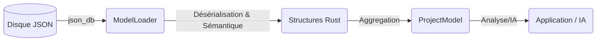

# Model Engine

Le **Model Engine** est la couche d'abstraction qui transforme les données brutes stockées dans la base de données (`json_db`) en structures Rust fortement typées et interconnectées.

Il agit comme un **ORM (Object-Relational Mapping)** spécialisé pour la méthode **Arcadia** et l'architecture **GenAptitude**, en s'appuyant sur une résolution sémantique stricte (JSON-LD).

---

## 🏗️ Architecture Globale

Le flux de données suit ce chemin :



---

## 📦 Rôles des Modules

| Module      | Description                                                                                                                                                           |
| :---------- | :-------------------------------------------------------------------------------------------------------------------------------------------------------------------- |
| `types.rs`  | (Anciennement `model.rs`) Définit la structure racine `ProjectModel` qui contient toutes les couches (OA, SA, LA, PA, EPBS) en mémoire.                               |
| `loader.rs` | Contient la logique d'extraction (`ModelLoader`). Il scanne les collections, effectue l'expansion JSON-LD, valide et instancie les objets selon leur type sémantique. |
| `common.rs` | Types primitifs partagés : `Uuid`, `I18nString` (multilingue), `BaseEntity` (ID, dates).                                                                              |
| `arcadia/`  | Implémentation des concepts métier Arcadia (Acteurs, Fonctions, Composants) via des macros.                                                                           |

---

## 🧠 Le Modèle en Mémoire (`ProjectModel`)

L'objet `ProjectModel` est le **jumeau numérique** du projet stocké sur le disque.
Il est organisé par couches d'ingénierie et défini dans `src/model_engine/types.rs` :

```rust
pub struct ProjectModel {
    #[serde(default)]
    pub oa: OperationalAnalysis,   // Besoins & Métier
    #[serde(default)]
    pub sa: SystemAnalysis,        // Ce que fait le système
    #[serde(default)]
    pub la: LogicalArchitecture,   // Comment (Logique)
    #[serde(default)]
    pub pa: PhysicalArchitecture,  // Comment (Physique/Logiciel)
    #[serde(default)]
    pub epbs: EPBS,                // Configuration Produits
    #[serde(default)]
    pub meta: ProjectMeta,         // Métadonnées globales
}
```

Chaque couche encapsule ses propres entités (acteurs, fonctions, composants, échanges, etc.) dans des vecteurs typés (`Vec<ArcadiaElement>`).

---

## 🔧 Implémentation Arcadia (`arcadia/`)

Pour éviter la répétition de code (boilerplate) et garantir la conformité avec les schémas JSON, nous utilisons une macro Rust puissante : **`arcadia_element!`**.

### La macro `arcadia_element!`

Définie dans `arcadia/metamodel.rs`, elle injecte automatiquement :

- **Héritage technique (`BaseEntity`)** : `id`, `$schema`, `createdAt`, `updatedAt`.
- **Héritage métier (`ArcadiaProperties`)** : `name`, `description`, `xmi_id`, `tags`, `propertyValues` (PVMT).
- **Champs spécifiques** : Ceux définis explicitement pour l'élément Arcadia (ex. nature, allocations, relations, etc.).

### Exemple d’implémentation (Physical Component)

```rust
arcadia_element!(PhysicalComponent {
    nature: String, // "Node" ou "Behavior"

    #[serde(default)]
    sub_components: Vec<ElementRef>, // Liste d'UUIDs

    #[serde(rename = "allocatedFunctions", default)]
    allocated_functions: Vec<ElementRef>
});
```

Cette macro génère une `struct PhysicalComponent` complète, prête à être sérialisée/désérialisée par **Serde**, avec tous les champs techniques et métier nécessaires.

---

## 📥 Le Chargeur (`loader.rs`)

Le `ModelLoader` est responsable de l'**hydratation** du modèle en mémoire à partir de la `json_db`. Il utilise une approche sémantique robuste basée sur le vocabulaire centralisé (`vocabulary.rs`).

### Responsabilités

1.  **Connexion** : Se connecter au `StorageEngine` (via `CollectionsManager`).
2.  **Expansion JSON-LD** : Utiliser le `JsonLdProcessor` pour résoudre les types (ex: `"oa:Actor"` devient `"https://genaptitude.io/ontology/arcadia/oa#OperationalActor"`).
3.  **Dispatch** : Trier les éléments dans les bonnes couches (`OA`, `SA`, `LA`...) en se basant sur leur URI de type canonique, et non sur des noms de fichiers ou de collections arbitraires.

### Utilisation

Le chargement est une opération lourde (I/O + CPU) qui doit être exécutée dans un thread dédié (`spawn_blocking`).

```rust
// 1. Initialiser le loader (depuis une commande Tauri)
// Utilise StorageEngine cloné pour être thread-safe et indépendant de l'état Tauri
let loader = ModelLoader::from_engine(&storage_engine, "space_id", "db_id");

// 2. Charger tout le projet (Synchrone, bloquant)
let model = loader.load_full_model()?;

// 3. Accéder aux données typées
println!("Nombre d'acteurs OA : {}", model.oa.actors.len());
```

---

## 🛠️ Types Communs (`common.rs`)

### `I18nString`

`I18nString` gère le **multilinguisme nativement** :

- Peut être une simple `String` : `"Bonjour"`
- Peut être une map clé/valeur : `{ "fr": "Bonjour", "en": "Hello" }`

Cela permet de stocker les noms, descriptions et labels dans plusieurs langues sans complexifier le modèle métier.

### `ElementRef`

`ElementRef` représente une référence vers un autre élément du modèle :

- Pour l'instant, c’est un **alias vers `String` (UUID)**.
- À l’avenir, cela pourra devenir un type intelligent permettant de **résoudre la référence** (pointeur vers l'objet réel en mémoire, avec éventuellement une API de navigation).

---

## ⚠️ Points d’Attention

- **Adhésion Sémantique** : Le moteur ne se base plus sur des chaînes magiques. Il utilise les constantes définies dans `src/json_db/jsonld/vocabulary.rs`. Si un type JSON-LD est inconnu, l'élément ne sera pas correctement classé dans le modèle en mémoire.
- **Performance & Threading** : Le chargement (`load_full_model`) est synchrone pour simplifier la logique interne (parcours récursif, I/O fichier standard). Il doit impérativement être encapsulé dans `tauri::async_runtime::spawn_blocking` lorsqu'il est appelé depuis une commande asynchrone pour ne pas bloquer la boucle d'événements principale.

---

Ce **Model Engine** fournit ainsi une base unique, cohérente et sémantiquement rigoureuse pour toutes les fonctionnalités d’analyse, de génération de code et d’IA de GenAptitude.
