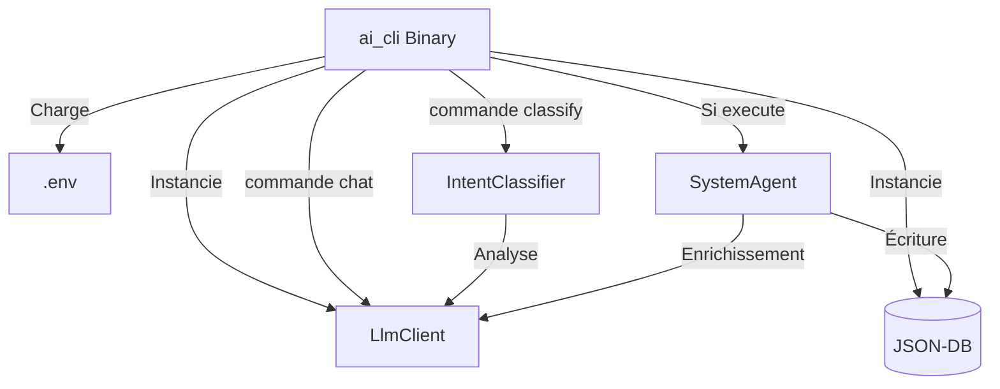

# AI CLI — Interface de Commande Neuro-Symbolique

**Package :** `ai_cli`
**Localisation :** `src-tauri/tools/ai_cli`
**Rôle :** Outil de développement, test et automatisation pour le module IA de GenAptitude.

---

## 🎯 Objectifs

L'`ai_cli` est un exécutable léger qui permet d'interagir directement avec le cœur intelligent de GenAptitude (le backend Rust) sans passer par l'interface graphique (Tauri/React).

Il est utilisé pour :

1.  **Valider la connectivité** avec les LLMs (Docker local ou Google Cloud).
2.  **Tester les prompts** et le classificateur d'intentions.
3.  **Exécuter des actions** sur la base de données (création d'acteurs, fonctions...) via les Agents.
4.  **Débugger** le pipeline RAG et l'enrichissement de données.

---

## ⚙️ Configuration

L'outil charge automatiquement le fichier `.env` situé à la racine du monorepo.

**Variables requises :**

```bash
# Choix du backend (si true + clé présente -> Cloud possible)
GENAPTITUDE_MODE_DUAL="true"

# Clés et URLs
GENAPTITUDE_LOCAL_URL="http://localhost:8080"
GENAPTITUDE_GEMINI_KEY="AIza..."
GENAPTITUDE_MODEL_NAME="gemini-1.5-pro"

# Base de données cible
PATH_GENAPTITUDE_DOMAIN="$HOME/genaptitude_domain"
```

---

## 🚀 Commandes Disponibles

L'outil s'exécute via Cargo depuis la racine du projet.

### 1\. `chat` (Discussion)

Discutez directement avec le modèle de langage. Utile pour tester la latence, la créativité ou la configuration réseau.

**Syntaxe :**

```bash
cargo run -p ai_cli -- chat [OPTIONS] <MESSAGE>
```

**Options :**

- `-c, --cloud` : Force l'utilisation du modèle Cloud (Gemini) même si le local est disponible.

**Exemple :**

```bash
# Test Local (Mistral)
cargo run -p ai_cli -- chat "Explique le MBSE en une phrase."

# Test Cloud (Gemini)
cargo run -p ai_cli -- chat "Génère un poème sur Rust" -c
```

---

### 2\. `classify` (Action & Agents)

C'est la commande principale. Elle simule le pipeline complet : **NLP → Intention → Agent → Base de Données**.

**Syntaxe :**

```bash
cargo run -p ai_cli -- classify [OPTIONS] <INPUT>
```

**Options :**

- `-x, --execute` : **Mode Écriture**. Sans ce flag, l'outil tourne en mode "Dry Run" (simulation) et n'altère pas la base de données.

**Workflow exécuté :**

1.  **Classification** : Analyse la phrase pour extraire l'intention (`CreateElement`).
2.  **Routing** : Sélectionne l'agent approprié (ex: `SystemAgent`).
3.  **Enrichissement** : L'agent demande au LLM de générer les champs manquants (description...).
4.  **Persistance** : L'agent insère la donnée validée dans `json_db`.

**Exemple complet :**

```bash
# 1. Simulation (Pour voir ce que l'IA a compris)
cargo run -p ai_cli -- classify "Crée une fonction 'Décoller'"

# Résultat :
# 🧠 Analyse : "Crée une fonction 'Décoller'"
# 🔧 ACTION : Créer Function (Décoller) dans SA
# (Dry Run - Utilisez -x pour exécuter)

# 2. Exécution (Pour agir réellement)
cargo run -p ai_cli -- classify "Crée une fonction 'Décoller'" -x

# Résultat :
# ⚡ Exécution SystemAgent...
# ✅ SUCCÈS : J'ai créé l'élément Décoller...
```

---

## 🏗️ Architecture Interne

Le CLI n'est qu'une coquille vide ("Thin Client"). Il importe et utilise directement la logique métier de la librairie principale `genaptitude`.



### Bootstrapping

Lors de son initialisation, le CLI (via `StorageEngine`) vérifie l'intégrité de la base de données. Si le dossier `schemas` est manquant dans la DB cible, il déclenche automatiquement une copie des schémas depuis le code source vers la base de données.

---

## 🐛 Dépannage fréquent

| Symptôme                | Cause probable                | Solution                                                                |
| :---------------------- | :---------------------------- | :---------------------------------------------------------------------- |
| `Connection refused`    | Docker éteint ou mauvais port | Vérifiez `docker ps` et `GENAPTITUDE_LOCAL_URL`                         |
| `403 Forbidden` (Cloud) | Clé API invalide              | Vérifiez `GENAPTITUDE_GEMINI_KEY` dans `.env`                           |
| `Schema not found`      | DB corrompue                  | `rm -rf $HOME/genaptitude_domain/un2` (le CLI réparera au prochain run) |
| `Partial move error`    | Bug Rust                      | Vérifiez l'utilisation de `ref` dans le `match intent`                  |

---

> **Note :** Pour voir les logs détaillés du moteur sous-jacent, préfixez votre commande :
> `RUST_LOG=debug cargo run -p ai_cli ...`
