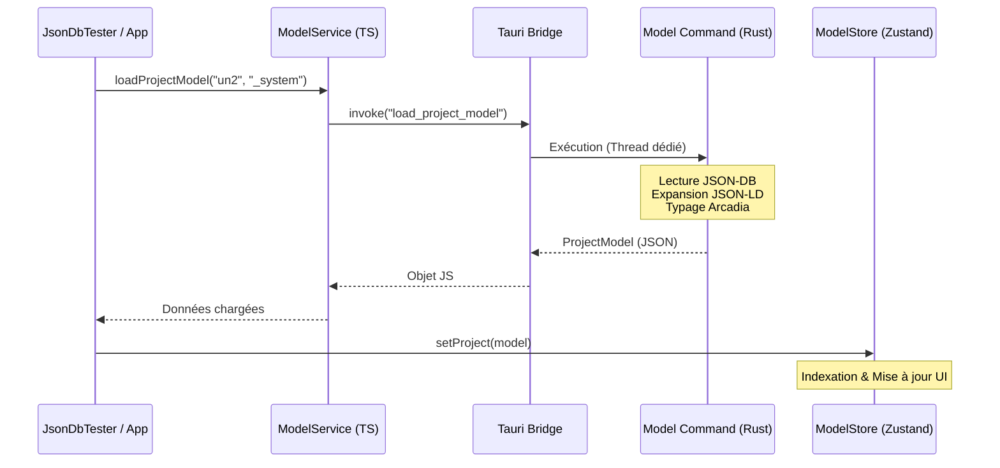

# Architecture Applicative Frontend (React)

**Package :** `src/`  
**Stack :** React 18, TypeScript, Vite, Zustand, Tauri IPC  
**Version :** 1.1 (Support Model Engine)

---

## 1. Vue d'Ensemble

Le frontend de GenAptitude est une **Single Page Application (SPA)** qui sert d'interface principale pour l'ingénieur système. Contrairement à une application web classique, elle agit comme une **interface native** pilotant le backend Rust via le pont IPC de Tauri.

### Responsabilités

- **Visualisation** : Affichage des diagrammes et arborescences Arcadia.
- **Interaction** : Chat avec l'IA, éditeurs de propriétés.
- **Orchestration** : Déclenchement des chargements de modèles et des transactions.

---

## 2. Architecture des Données (Stores)

La gestion d'état est assurée par **Zustand**. Les stores sont découpés par domaine fonctionnel.

### `useModelStore` (src/store/model-store.ts)

C'est le store central pour les données d'ingénierie. Depuis la v1.1, il ne stocke plus une liste plate d'éléments, mais une structure hiérarchique complète.

```typescript
interface ModelStoreState {
  project: ProjectModel | null; // Structure complète (OA, SA, LA, PA, EPBS)

  // Indexation pour accès O(1)
  elementsById: Record<string, ArcadiaElement>;

  // Actions
  setProject: (model: ProjectModel) => void;
  selectElement: (id: string) => void;
}
```

### `useAiStore` (src/store/ai-store.ts)

Gère l'historique de conversation avec les agents et l'état de "réflexion" (loading).

### `useUiStore` (src/store/ui-store.ts)

Gère l'état de l'interface pure (Thème Dark/Light, Sidebar ouverte/fermée, Layout).

---

## 3\. Services & Intégration (IPC)

Les services (dans `src/services/`) encapsulent les appels `invoke` vers Tauri. Ils sont typés et gèrent les erreurs.

### `ModelService` (src/services/model-service.ts)

**Nouveau en v1.1**. Il est responsable du chargement sémantique du projet.

- **Méthode** : `loadProjectModel(space, db)`
- **Commande Rust** : `load_project_model`
- **Rôle** : Déclenche le chargement lourd côté backend et récupère l'objet `ProjectModel` structuré.

### `CollectionService` (src/services/json-db/collection-service.ts)

Gère les opérations CRUD bas niveau sur les documents JSON.

- **Méthodes** : `createCollection`, `insertDocument`, `queryDocuments`...
- **Usage** : Utilisé pour les modifications unitaires ou les outils de debug (`JsonDbTester`).

---

## 4\. Composants Clés

### `JsonDbTester` (src/components/JsonDbTester.tsx)

Composant de diagnostic et de prototypage.

- Permet de visualiser le contenu brut de la base.
- **Nouveauté** : Bouton "Charger Modèle" qui hydrate le `useModelStore` via le `ModelService`.

### `ChatInterface` (src/components/ai-chat/ChatInterface.tsx)

Interface conversationnelle principale.

- Connectée au `useAiStore`.
- Affiche les intentions détectées et les réponses des agents.

---

## 5\. Flux de Chargement du Modèle

Voici comment les données transitent du disque vers l'interface utilisateur :



---

## 6\. Structure du Projet

```text
src/
├── components/          # Composants React (Atoms, Molecules)
│   ├── ai-chat/         # Interface Assistant
│   ├── shared/          # Boutons, Cards, Modales génériques
│   └── JsonDbTester.tsx # Outil de debug DB/Model
├── hooks/               # Custom Hooks (useTauriEvent, etc.)
├── services/            # Couche d'accès aux données (Tauri IPC)
│   ├── model-service.ts # Chargement sémantique
│   └── json-db/         # CRUD base de données
├── store/               # État global (Zustand)
│   ├── model-store.ts   # Données Arcadia
│   └── ai-store.ts      # Conversation
├── types/               # Définitions TypeScript partagées
│   └── model.types.ts   # Types Arcadia (OA, SA, LA...)
├── styles/              # CSS Global & Variables
├── App.tsx              # Racine de l'application
└── main.tsx             # Point d'entrée Vite
```

---

## 7\. Guide de Développement

### Ajouter une fonctionnalité métier

1.  **Backend** : Implémenter la commande dans `src-tauri/src/commands/`.
2.  **Types** : Mettre à jour `src/types/` pour refléter les structures Rust.
3.  **Service** : Ajouter la méthode dans le service approprié (`src/services/`).
4.  **Store** : (Optionnel) Ajouter l'action dans le store Zustand si l'état est partagé.
5.  **UI** : Créer le composant consommant le service ou le store.

### Bonnes Pratiques

- **Zéro Logique Métier dans l'UI** : Les composants ne doivent faire que de l'affichage. La logique complexe doit être dans les Services (appels) ou les Stores (état).
- **Typage Strict** : Ne jamais utiliser `any` pour les objets du modèle. Utiliser les interfaces de `model.types.ts`.
- **Async/Await** : Tous les appels Tauri sont asynchrones. Gérer les états de chargement (`isLoading`).
